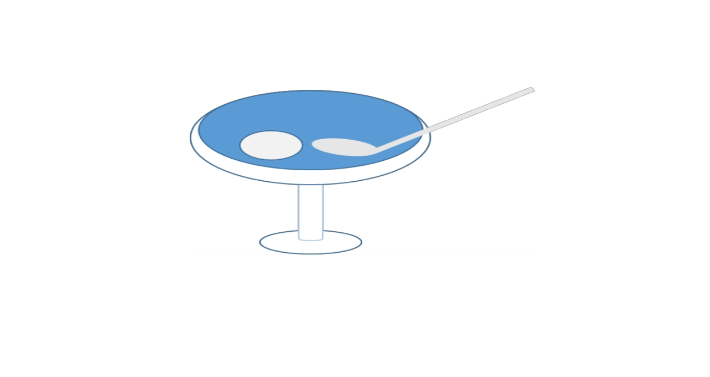

# 

## Description

このリポジトリは、仮想店舗のアイスクリーム店を想定した業務システムを想定しています。

業務システムの構築の考察・検討作業時に、こちらを参考にすることができます。

## Usage

詳細なコマンドは以下の scripts のセクションをご覧ください。

ここに記載予定

## License

- [MIT](./LICENSE)

## Author

- [Twitter](https://twitter.com/onesword0618)
